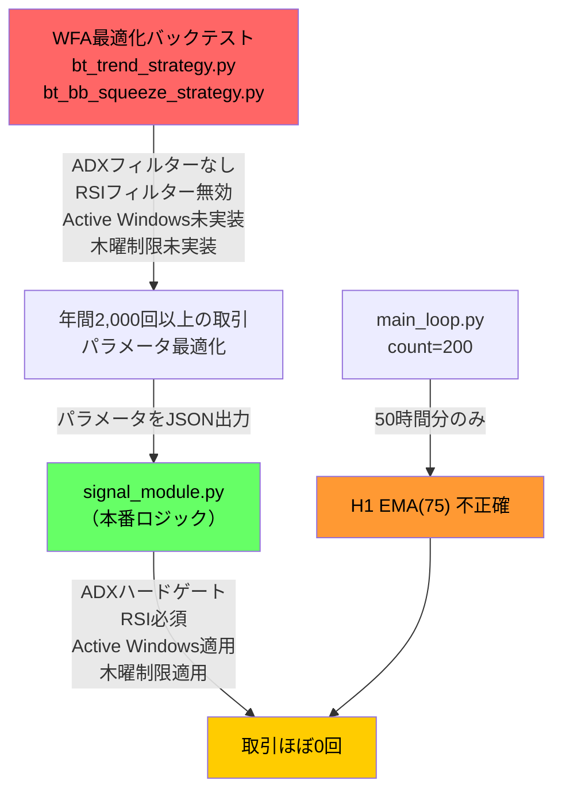

# 🔍 シグナルロジック乖離 調査報告書
## バックテスト（年間2,000回超）vs 仮想フォワードテスト（取引ほぼ0回）の原因究明

> **調査日時:** 2026-08-10 15:00 JST  
> **調査範囲:** FXsys プロジェクト全体（signal_module.py, optimize.py, replay_backtester.py, data.py, indicators.py, main_loop.py, config.json, bt_trend_strategy.py, bt_bb_squeeze_strategy.py）

---

## 総合判定

> [!CAUTION]
> **致命的な構造的欠陥が3つ発見されました。**  
> WFA最適化バックテストと本番シグナルモジュールの間で、**エントリーロジックが根本的に異なるコードで実装**されており、最適化されたパラメータが本番環境では機能しません。さらに、本番環境のウォームアップデータ量が数学的に不足しており、インジケーターの計算結果自体が不正確です。

---

## 1. シグナル判定ロジックの共通化状況

### 結論：❌ **共通化されていない（最大の問題）**

本プロジェクトには、シグナル判定ロジックが **3つの異なる実装** として存在しています。

| 実行コンテキスト | 使用スクリプト | シグナル生成方式 |
|---|---|---|
| **本番（リアルタイム）** | [signal_module.py](file:///mnt/c/WealthSystem/FXsys/core/signal_module.py) | 1行ずつ逐次評価 |
| **WFA最適化バックテスト** | [bt_trend_strategy.py](file:///mnt/c/WealthSystem/FXsys/core/backtest/strategies/bt_trend_strategy.py), [bt_bb_squeeze_strategy.py](file:///mnt/c/WealthSystem/FXsys/core/backtest/strategies/bt_bb_squeeze_strategy.py) | Polarsベクトル化 + vectorbt |
| **R&Dリプレイバックテスト** | [replay_backtester.py](file:///mnt/c/WealthSystem/FXsys/replay_backtester.py) → signal_module.py | 本番と同一コードを呼び出し ✅ |

### 🚨 致命的な乖離の詳細

#### 乖離①：ADXフィルターの欠落（トレンド戦略）

**本番（signal_module.py）：** ADXは**ハードゲート**（閾値を超えないとエントリーしない）
```python
# signal_module.py — ADXが閾値未満なら即却下
adx_passed = (curr_adx_m15 >= adx_threshold) if use_adx else True
if enable_trend and adx_passed:
    if h1_long_cond and m15_long_cond: trend_signal = "long"
```

**WFA最適化（bt_trend_strategy.py）：** ADXは**ソフト加点のみ**（ADXが0でもエントリー可能）
```python
# bt_trend_strategy.py — ADXフィルターなし！
long_entries = h1_uptrend & m15_momentum_up & ~pl.col("is_forbidden_time")
```
ADXはスコアに+0.15の加点として使われるだけで、`ai_score_half_lot` が低く最適化されると、ADXゼロでも取引が成立してしまいます。

#### 乖離②：RSI・MACDフィルターの無効化（BBスクイーズ戦略）

**本番（signal_module.py）：** RSIは**必須条件**
```python
# signal_module.py — RSI必須
if is_squeezed and curr_close > curr_bb_upper and (curr_rsi_m15 >= rsi_long_th):
    squeeze_signal = "long"
```

**WFA最適化（bt_bb_squeeze_strategy.py）：** RSI・MACDフィルターが**常に無効**
```python
# bt_bb_squeeze_strategy.py — use_rsi_filterがFalseのため、常にTrue
(pl.lit(not getattr(self, 'use_rsi_filter', False)) | (pl.col("rsi_m15") >= rsi_long_th))
# ↑ not False = True → OR条件が常にTrue → RSI条件をスキップ
```
`use_macd_filter` と `use_rsi_filter` がクラスで定義されておらず、`getattr(..., False)` で常に `False` → `not False = True` となり、これらのフィルターが**完全に無視**されています。

#### 乖離③：Active Windows（取引許可時間帯）の欠落

**本番（signal_module.py）：** 通貨ペアごとの取引可能時間帯を厳格に適用
```python
# signal_module.py — 各ペアにアクティブウィンドウを適用
active_windows = system_cfg.get("active_windows", {}).get(pair, [])
# 例: USD_JPY: [{'start': '09:30', 'end': '11:30'}, {'start': '16:30', 'end': '17:59'}, ...]
```

**WFA最適化（bt_trend_strategy.py, bt_bb_squeeze_strategy.py）：** Active Windows **未実装**  
→ バックテストでは24時間取引が行われるため、取引回数が本番の数倍〜数十倍になります。

#### 乖離④：木曜日制限の欠落

**本番（signal_module.py）：** `forbidden_hours` と `forbidden_pairs` を適用
```python
# signal_module.py
if weekday == 3 and thu_cfg.get("enabled", False):
    # 特定時間帯と特定ペアを制限
```

**WFA最適化：** 木曜日制限 **未実装**

### ⚠️ これがなぜ致命的なのか

```
WFA最適化（ゆるいルール）   →  年間2,000回以上の取引で最適パラメータを算出
        ↓ パラメータを適用
本番シグナル（厳格なルール） →  取引ほぼ0回
```

**WFAで見つけたパラメータは「本番とは別のゲーム」で最適化されたもの**です。たとえば、ADXの閾値が34と算出されても、それはバックテストでADXフィルター自体を使っていなかったため、ADXの値によってシグナルを出すか出さないかという判断に影響していません。パラメータはスコア加点にのみ使われ、本番のハードゲートとしては意味を持っていないのです。

---

## 2. データ参照・計算のタイミング（未来参照とルックアヘッドバイアス）

### 結論：⚠️ **H1足の処理は安全、M15足に潜在リスクあり**

#### H1足の処理（安全 ✅）
[indicators.py](file:///mnt/c/WealthSystem/FXsys/core/indicators.py) でH1足のEMAをM15にマッピングする際、正しく `.shift(1)` が適用されています：
```python
# indicators.py — H1→M15マッピング（安全）
df_pd['ema_fast_h1'] = ema_fast_h1.shift(1).reindex(df_calc.index, method='ffill')
```
これにより、確定したH1足のEMA値のみが使用され、未確定足の影響は排除されています。

#### M15足の処理（潜在リスク ⚠️）
M5データが入力された場合の M15 リサンプリングにおいて、`.shift(1)` が**適用されていません**：
```python
# indicators.py — M15マッピング（shift未適用）
df_pd['hist_m15'] = hist_m15.reindex(df_calc.index, method='ffill')
```

> [!NOTE]
> **現状の運用では偶然回避されています。** 本番（`main_loop.py`）では入力データが既にM15のため、このリサンプリングは実質的に恒等変換（no-op）となり、ルックアヘッドバイアスは発生しません。ただし、将来M5データを入力するケースでは問題になります。

---

## 3. ウォームアップデータの確保

### 結論：❌ **致命的に不足**

#### 現在の取得量
[main_loop.py](file:///mnt/c/WealthSystem/FXsys/main_loop.py) でのリアルタイムデータ取得：
```python
# main_loop.py — リアルタイム取引サイクル
df_m15 = await fetch_candles(pair, gran="M15", count=200)
```

#### 必要量の計算

| インジケーター | 必要なH1足数 | 必要なM15足数 | 安定化に必要なM15足数 |
|---|---|---|---|
| EMA Slow (最大75) | 75本 | 300本 | **900〜1,200本** |
| ボリンジャーバンド (50期間) | 50本 | 200本 | **600〜800本** |
| ADX (14期間) | 14本 | 56本 | 168本 |

**現在の取得量：200本（M15）= わずか50時間分**

EMA(75) on H1 を正しく計算するには、最低でも 75時間 = 300本のM15足が必要ですが、EMAが安定するには通常3〜4倍の期間が推奨されます。つまり**900〜1,200本のM15足**が必要です。

> [!WARNING]
> **200本しか取得していないため、H1 EMA(75) は数学的に不正確です。**  
> EMAの指数平滑化は初期値に大きく依存するため、データ量が足りないと全く異なる値を算出します。
> これにより、`H1 Close > H1 EMA Fast > H1 EMA Slow` といったトレンド判定条件が本来とは異なる結果を返し、シグナルが正しく生成されない原因となっている可能性があります。

#### バックテスト（optimize.py）との比較
WFA最適化では数ヶ月〜1年分のヒストリカルデータを一括で読み込むため、EMAは完全に安定した状態で計算されます。これもバックテストと本番の乖離要因の一つです。

---

## 4. Signal Funnel（シグナル除外理由）のログ出力

### 結論：✅ **実装済み（ただし改善の余地あり）**

[signal_module.py](file:///mnt/c/WealthSystem/FXsys/core/signal_module.py) には `[DEBUG-SIG]` タグによるシグナルファネルログが実装されています：

| ログ出力 | 除外理由 | 実装状況 |
|---|---|---|
| `[DEBUG-SIG] Rejected: Weekend (5)` | 土曜日 | ✅ |
| `[DEBUG-SIG] Rejected: Friday Stop (Hour: 20 >= 20)` | 金曜日停止 | ✅ |
| `[DEBUG-SIG] Rejected: Forbidden Time (01:00:00 in 01:00-09:00)` | 禁止時間帯 | ✅ |
| `[DEBUG-SIG] Rejected: Outside Active Windows (...)` | アクティブウィンドウ外 | ✅ |
| `[DEBUG-SIG] Rejected: Thursday forbidden hour/pair` | 木曜日制限 | ✅ |
| `[DEBUG-SIG] No signal match (final_signal=None)` | テクニカル条件不一致 | ✅ |
| `[DEBUG-SIG-EVAL] trend_long=... squeeze_long=...` | 個別条件の真偽値 | ✅ |

#### 改善の余地
現在のログは**「時間帯フィルターでの除外」**は非常に詳細ですが、テクニカル条件での除外時（`No signal match`）に**「なぜシグナルが出なかったか」の内訳**（例：「RSIが閾値未達 (52.3 < 60.0)」「ADXが閾値未達 (28.5 < 34.0)」）が個別に記録されていません。`[DEBUG-SIG-EVAL]` ではboolean値の一覧は出力されていますが、各条件の**具体的な数値（実際のRSI値や閾値）**までは記録されていません。

---

## 根本原因のまとめ



| # | 原因 | 深刻度 | 影響 |
|---|---|---|---|
| 1 | **WFA最適化ロジックと本番ロジックが別実装** | 🔴 致命的 | 最適化パラメータが本番で無意味 |
| 2 | **Active Windows が最適化に未実装** | 🔴 致命的 | バックテストが24時間取引し取引回数が膨張 |
| 3 | **RSI/MACDフィルターがバックテストで常時無効** | 🔴 致命的 | 低品質なシグナルで最適化が実行される |
| 4 | **ウォームアップデータ不足（200本 vs 必要1,200本）** | 🟠 重大 | 本番のEMA計算が数学的に不正確 |
| 5 | **ADXがバックテストでソフト加点のみ** | 🔴 致命的 | ADX閾値パラメータが事実上機能しない |

---

## 推奨される修正方針

> [!IMPORTANT]
> 以下は調査結果に基づく推奨事項です。実際の修正は別途ご指示をいただいてから実施します。

### 最優先（修正なしではシステムが機能しない）

1. **WFA最適化ロジックの統一:** `bt_trend_strategy.py` と `bt_bb_squeeze_strategy.py` に、signal_module.py と同等の ADXハードゲート、RSIフィルター、Active Windows、木曜制限 を実装する。
2. **ウォームアップデータの拡大:** `main_loop.py` の `count=200` を `count=1500` 以上に変更する。

### 次点（精度向上）

3. **Signal Funnel の強化:** `No signal match` 時に「RSI=52.3 < threshold=60.0」のような数値付きログを出力する。
4. **M15リサンプリングへの shift(1) 適用:** 将来のM5データ対応に備える。
